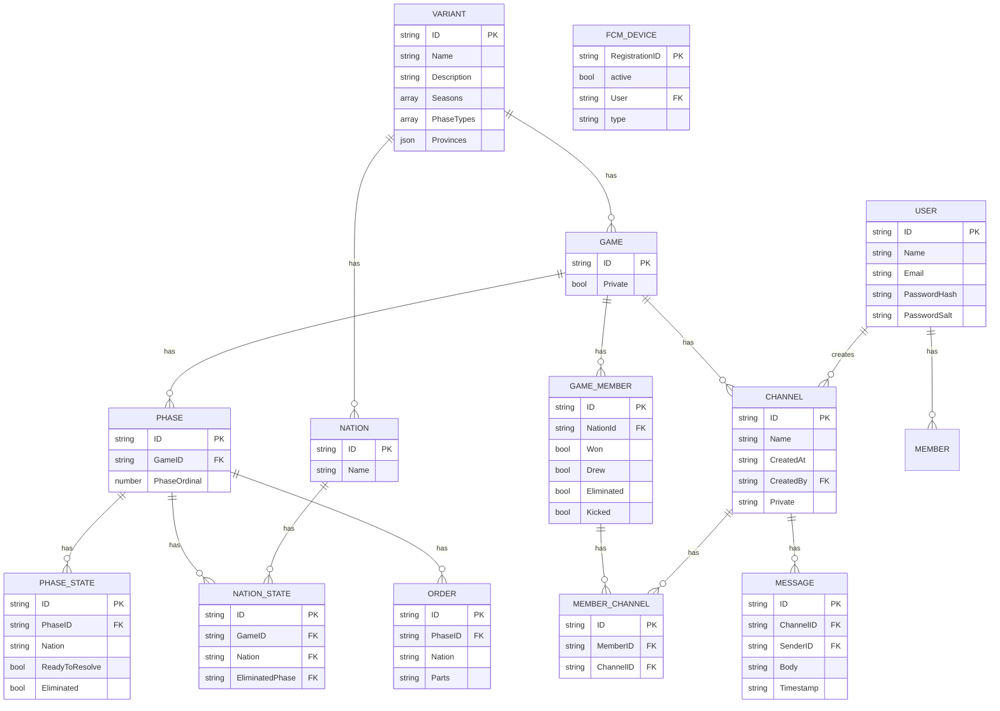

```mermaid
erDiagram
    VARIANT ||--o{ GAME : has
    VARIANT ||--o{ NATION : has
    VARIANT {
        string ID PK
        string Name
        string Description
        array Seasons
        array PhaseTypes
        json Provinces

    }
    GAME ||--o{ PHASE : has
    GAME ||--o{ GAME_MEMBER : has
    GAME ||--o{ CHANNEL : has
    GAME {
        string ID PK
        bool Private
    }
    PHASE ||--o{ PHASE_STATE : has
    PHASE ||--o{ NATION_STATE : has
    PHASE ||--o{ ORDER : has
    PHASE {
        string ID PK
        string GameID FK
        number PhaseOrdinal
    }
    PHASE_STATE {
        string ID PK
        string PhaseID FK
        string Nation
        bool ReadyToResolve
        bool Eliminated
    }
    ORDER {
        string ID PK
        string PhaseID FK
        string Nation
        string Parts
    }
    NATION ||--o{ NATION_STATE : has
    NATION {
        string ID PK
        string Name
    }
    NATION_STATE {
        string ID PK
        string GameID FK
        string Nation FK
        string EliminatedPhase FK
    }
    USER ||--o{ MEMBER : has
    USER ||--o{ CHANNEL : creates
    USER {
        string ID PK
        string Name
        string Email
        string PasswordHash
        string PasswordSalt
    }
    GAME_MEMBER ||--o{ MEMBER_CHANNEL : has
    GAME_MEMBER {
        string ID PK
        string NationId FK
        bool Won
        bool Drew
        bool Eliminated
        bool Kicked
    }
    CHANNEL ||--o{ MESSAGE : has
    CHANNEL ||--o{ MEMBER_CHANNEL : has
    CHANNEL {
        string ID PK
        string Name
        string CreatedAt
        string CreatedBy FK
        string Private
    }
    MEMBER_CHANNEL {
        string ID PK
        string MemberID FK
        string ChannelID FK
    }
    MESSAGE {
        string ID PK
        string ChannelID FK
        string SenderID FK
        string Body
        string Timestamp
    }
    FCM_DEVICE {
        string RegistrationID PK
        bool active
        string User FK
        string type
    }
```
